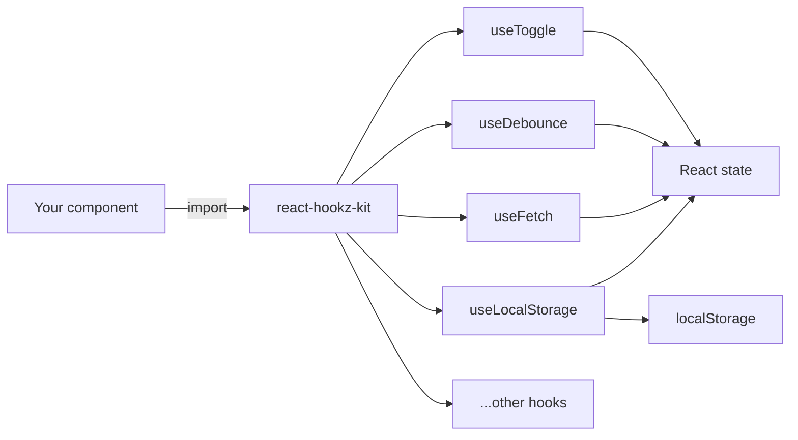
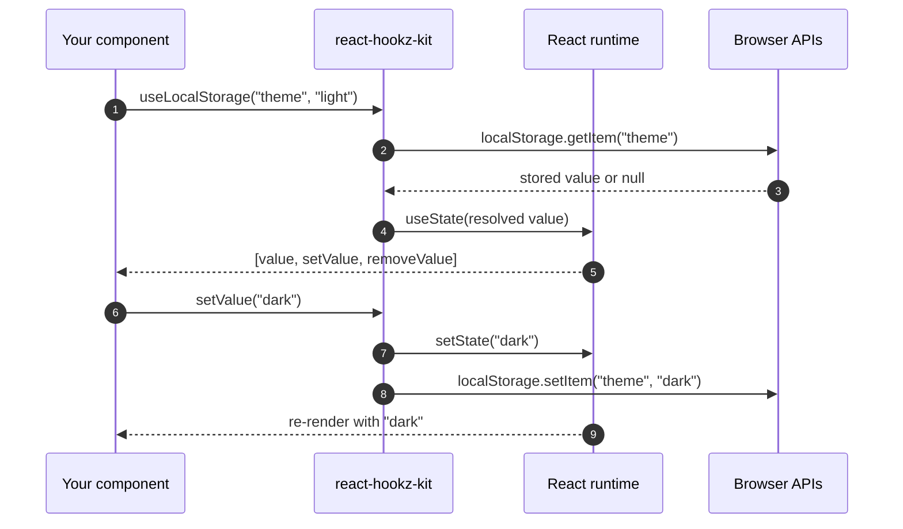

# react-hookz-kit

<p align="center">
  <strong>Essential React hooks for everyday development.</strong><br/>
  Zero dependencies. TypeScript-first. Tree-shakeable.
</p>

<p align="center">
  <a href="LICENSE"></a>
  
  
  
  
</p>

<p align="center">
  <a href="#the-idea">The idea</a> ·
  <a href="#-hooks">Hooks</a> ·
  <a href="#-install">Install</a> ·
  <a href="#-how-it-works">How it works</a> ·
  <a href="#-usage">Usage</a> ·
  <a href="#-architecture">Architecture</a> ·
  <a href="#-comparison">Comparison</a> ·
  <a href="#-faq">FAQ</a> ·
  <a href="#-docs">Docs</a>
</p>

---

## The idea

Most React projects re-invent the same hooks — toggle, debounce, localStorage,
fetch, media queries. Each copy is slightly different, rarely tested, never
typed well.

**react-hookz-kit** solves this:

| Principle | How |
|-----------|-----|
| **One file per hook** | Import only what you use — bundler drops the rest |
| **Zero dependencies** | Only `react` as peer dep — no supply-chain risk |
| **TypeScript strict** | Full generics, no `any`, complete inference |
| **Tested** | Every hook has Vitest tests with `@testing-library/react` |

---

## 🪝 Hooks

| Hook | Purpose | Key feature |
|------|---------|-------------|
| [`useToggle`](#usetoggle) | Boolean on/off state | Stable `toggle` callback |
| [`useLocalStorage`](#uselocalstorage) | Persist state in localStorage | Auto JSON serialize, `remove()` |
| [`useDebounce`](#usedebounce) | Debounce fast-changing values | Configurable delay, auto-cleanup |
| [`useFetch`](#usefetch) | Data fetching | Abort on unmount, `refetch()`, `enabled` flag |
| [`useMediaQuery`](#usemediaquery) | CSS media query matching | SSR-safe, live updates |
| [`useClickOutside`](#useclickoutside) | Detect outside clicks | Returns ref, handles mouse + touch |
| [`usePrevious`](#useprevious) | Previous render value | Generic, zero-cost |
| [`useInterval`](#useinterval) | Declarative setInterval | Pause with `null`, latest callback |

---

## 📦 Install

```bash
npm install react-hookz-kit
```

```bash
yarn add react-hookz-kit
```

```bash
pnpm add react-hookz-kit
```

> **Peer dependency:** `react >= 16.8.0`

---

## 🧭 How it works



1. **Import** — pick only the hooks you need (tree-shakeable)
2. **Call** — each hook returns typed state + actions
3. **React handles the rest** — re-renders, cleanup, lifecycle



---

## 📖 Usage

### useToggle

```tsx
import { useToggle } from "react-hookz-kit";

function App() {
  const [isOpen, toggle] = useToggle(false);

  return <button onClick={toggle}>{isOpen ? "Close" : "Open"}</button>;
}
```

### useLocalStorage

```tsx
import { useLocalStorage } from "react-hookz-kit";

function App() {
  const [theme, setTheme, removeTheme] = useLocalStorage("theme", "light");

  return (
    <div>
      <p>Current: {theme}</p>
      <button onClick={() => setTheme("dark")}>Dark</button>
      <button onClick={removeTheme}>Reset</button>
    </div>
  );
}
```

### useDebounce

```tsx
import { useDebounce } from "react-hookz-kit";

function Search() {
  const [query, setQuery] = useState("");
  const debouncedQuery = useDebounce(query, 300);

  useEffect(() => {
    if (debouncedQuery) fetchResults(debouncedQuery);
  }, [debouncedQuery]);

  return <input value={query} onChange={(e) => setQuery(e.target.value)} />;
}
```

### useFetch

```tsx
import { useFetch } from "react-hookz-kit";

function UserProfile({ id }: { id: string }) {
  const { data, loading, error, refetch } = useFetch<User>(
    `https://api.example.com/users/${id}`
  );

  if (loading) return <p>Loading...</p>;
  if (error) return <p>Error: {error.message}</p>;

  return (
    <div>
      <h1>{data?.name}</h1>
      <button onClick={refetch}>Refresh</button>
    </div>
  );
}
```

### useMediaQuery

```tsx
import { useMediaQuery } from "react-hookz-kit";

function App() {
  const isMobile = useMediaQuery("(max-width: 768px)");

  return <nav>{isMobile ? <MobileMenu /> : <DesktopMenu />}</nav>;
}
```

### useClickOutside

```tsx
import { useClickOutside } from "react-hookz-kit";

function Dropdown() {
  const [open, setOpen] = useState(true);
  const ref = useClickOutside<HTMLDivElement>(() => setOpen(false));

  if (!open) return null;
  return <div ref={ref}>Dropdown content</div>;
}
```

### usePrevious

```tsx
import { usePrevious } from "react-hookz-kit";

function Counter() {
  const [count, setCount] = useState(0);
  const prevCount = usePrevious(count);

  return (
    <p>
      Now: {count}, Before: {prevCount ?? "none"}
    </p>
  );
}
```

### useInterval

```tsx
import { useInterval } from "react-hookz-kit";

function Timer() {
  const [seconds, setSeconds] = useState(0);
  const [running, setRunning] = useState(true);

  useInterval(() => setSeconds((s) => s + 1), running ? 1000 : null);

  return (
    <div>
      <p>{seconds}s</p>
      <button onClick={() => setRunning(!running)}>
        {running ? "Pause" : "Resume"}
      </button>
    </div>
  );
}
```

---

## 🏗 Architecture

```
src/
├── index.ts          # Public API — re-exports all hooks
├── useToggle.ts      # Boolean toggle
├── useLocalStorage.ts # localStorage sync
├── useDebounce.ts    # Value debouncing
├── useFetch.ts       # Data fetching
├── useMediaQuery.ts  # Media query matching
├── useClickOutside.ts # Outside click detection
├── usePrevious.ts    # Previous value tracking
└── useInterval.ts    # Declarative intervals

tests/
├── setup.ts          # Test environment config
├── useToggle.test.ts
├── useDebounce.test.ts
├── usePrevious.test.ts
├── useLocalStorage.test.ts
└── useInterval.test.ts
```

| File | Role |
|------|------|
| `src/index.ts` | Barrel export — the public API surface |
| `src/use*.ts` | One hook per file, self-contained |
| `tests/use*.test.ts` | Unit tests with `@testing-library/react` |
| `tsup.config.ts` | Build config — ESM + CJS + `.d.ts` |
| `vitest.config.ts` | Test runner config with jsdom |

Build output:

| Format | File | Use case |
|--------|------|----------|
| ESM | `dist/index.mjs` | Modern bundlers (Vite, webpack 5+) |
| CJS | `dist/index.js` | Node.js, legacy bundlers |
| Types | `dist/index.d.ts` | TypeScript consumers |

---

## 🆚 Comparison

| | **react-hookz-kit** | **Writing your own** | **Large hook libs** |
|--|---------------------|----------------------|---------------------|
| **Dependencies** | 0 | 0 | Often many |
| **Bundle size** | Tree-shake to ~1KB per hook | Varies | Often >10KB |
| **TypeScript** | Strict, full generics | Usually `any` | Varies |
| **Tested** | Yes, all hooks | Rarely | Usually |
| **Maintenance** | Community | You | Large team |
| **Learning curve** | Minimal — standard React patterns | N/A | Library-specific API |

### When to pick what

| You need… | Prefer |
|-----------|--------|
| A few well-typed hooks, no bloat | **react-hookz-kit** |
| Full UI component library | Chakra / MUI hooks |
| One specific hook | Copy from here or write your own |
| Animation / gesture hooks | framer-motion / use-gesture |

---

## ❓ FAQ

**Do I need all the hooks?**
No. Import only what you use — unused hooks are tree-shaken out.

**What React versions are supported?**
Anything with hooks: React 16.8+, 17, 18, 19.

**Does it work with Next.js / Remix / Vite?**
Yes. ESM and CJS builds are both included.

**Is `useFetch` a replacement for TanStack Query?**
No. `useFetch` is a lightweight fetch wrapper. For caching, pagination, and mutations, use TanStack Query.

**Can I use this with JavaScript (no TypeScript)?**
Yes. The package ships compiled JS with `.d.ts` type definitions.

**How do I contribute a new hook?**
See [CONTRIBUTING.md](CONTRIBUTING.md). One file, one export, one test file.

**Is this API stable?**
v1.x public API is stable. Breaking changes only in major versions.

---

## Quick start (copy-paste)

```bash
npm install react-hookz-kit
```

```tsx
import { useToggle, useDebounce, useLocalStorage } from "react-hookz-kit";

function App() {
  const [dark, toggleDark] = useToggle(false);
  const [search, setSearch] = useState("");
  const debouncedSearch = useDebounce(search, 300);
  const [lang, setLang] = useLocalStorage("lang", "en");

  return (
    <div className={dark ? "dark" : "light"}>
      <button onClick={toggleDark}>Toggle theme</button>
      <input value={search} onChange={(e) => setSearch(e.target.value)} />
      <p>Searching: {debouncedSearch}</p>
      <select value={lang} onChange={(e) => setLang(e.target.value)}>
        <option value="en">English</option>
        <option value="vi">Tiếng Việt</option>
      </select>
    </div>
  );
}
```

---

## 📚 Docs

- [API Reference v1.0](docs/api-1.0.md) — every hook signature, params, return types
- [Hook Guide](docs/guide.md) — composition patterns, SSR notes, bundle size

---

## Contributing & license

```bash
npm install
npm test
npm run build
```

- [CONTRIBUTING.md](CONTRIBUTING.md) · [SECURITY.md](SECURITY.md)
- MIT License — [LICENSE](LICENSE)
- [CHANGELOG.md](CHANGELOG.md)
- Maintainer: [huynhson0809](https://github.com/huynhson0809)
